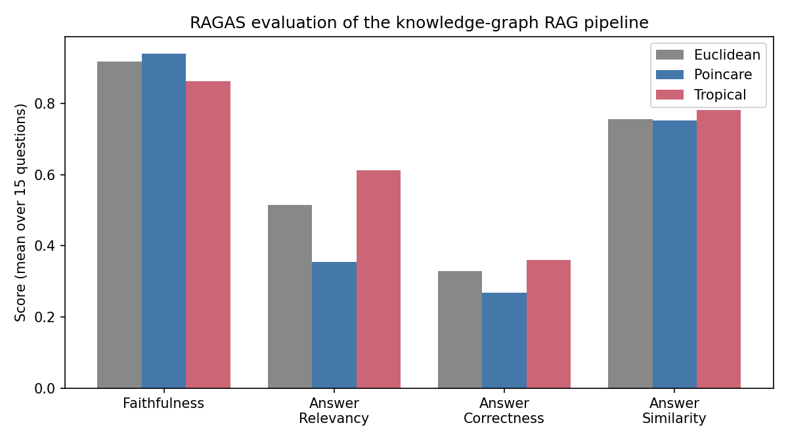

# Tropical AI — Tropical Geometry for Hierarchical Embeddings

This repository asks whether **tropical (max-plus) geometry**, a branch of
mathematics with an established but narrow role in algebraic geometry and
phylogenetics, is a competitive alternative to the two standard choices —
Euclidean and hyperbolic (Poincaré) space — for embedding hierarchical and
graph-structured data. It is validated on held-out link prediction across
4 independently-sourced real datasets, then deployed as the retrieval step
of a live knowledge-graph RAG system and scored against an industry-standard
RAG evaluation framework (RAGAS).

CPU-only throughout. No synthetic data: every dataset is a real ontology,
taxonomy, or live-crawled knowledge graph.

## Contents

1. [What is tropical geometry?](#1-what-is-tropical-geometry)
2. [Motivation: why not just use Euclidean space?](#2-motivation-why-not-just-use-euclidean-space)
3. [The established answer: Poincaré (hyperbolic) embeddings](#3-the-established-answer-poincaré-hyperbolic-embeddings)
4. [Why tropical geometry might also work for hierarchies](#4-why-tropical-geometry-might-also-work-for-hierarchies)
5. [How the tropical embeddings were built](#5-how-the-tropical-embeddings-were-built)
6. [Experiments](#6-experiments)
7. [Results](#7-results)
8. [Application: a knowledge-graph RAG system](#8-application-a-knowledge-graph-rag-system)
9. [Evaluation: RAGAS](#9-evaluation-ragas)
10. [Repository structure](#10-repository-structure)
11. [Setup and running](#11-setup-and-running)
12. [Honest limitations](#12-honest-limitations)
13. [How AI was used](#13-how-ai-was-used)

---

## 1. What is tropical geometry?

Tropical geometry is algebraic geometry done over the **tropical semiring**:
ordinary addition and multiplication are replaced with

```
x ⊕ y = max(x, y)        x ⊗ y = x + y
```

(the "min-plus" convention, using `min` instead of `max`, is equally
common — this project uses max-plus throughout). Under this re-definition,
a "tropical polynomial" like `3 ⊗ x ⊕ 1 ⊗ y ⊕ 2` is really just
`max(x + 3, y + 1, 2)` — **every tropical polynomial is a piecewise-linear,
convex function**. A "tropical curve" or "tropical variety" is the
non-differentiable locus of such a function — the set of points where two
or more of the linear pieces tie for the maximum. Where classical algebraic
geometry studies smooth curves and varieties, tropical geometry studies
their polyhedral, combinatorial shadow.

The bridge between the two is **Maslov dequantization**: the classical
log-sum-exp identity

```
t · log(e^(a/t) + e^(b/t)) → max(a, b)     as t → 0
```

turns ordinary addition into tropical addition in the limit. This is not
just a piece of background theory here — it is the literal mechanism used
to train the tropical embeddings in this project (Section 5): training
happens at `t > 0`, where gradients are dense and well-behaved, and `t` is
annealed toward 0 so the model converges to the true tropical metric by the
end of training.

### Where tropical geometry already shows up in AI

Tropical geometry is not a purely theoretical detour from machine learning —
it already intersects it in a few concrete, established places:

- **Tree metrics are tropical objects.** A classical result (Buneman, 1974)
  — the "four-point condition" — says a metric `d` comes from an exact tree
  if and only if, for every four points `w, x, y, z`, the two largest of
  `{d(w,x)+d(y,z), d(w,y)+d(x,z), d(w,z)+d(x,y)}` are equal. That is a
  statement about which pairwise sum is *extremal* — a max-plus condition,
  not a Euclidean one. Separately, the tropical Grassmannian (Speyer &
  Sturmfels, 2004) parametrizes exactly the tree metrics on a fixed leaf
  set, and the Billera–Holmes–Vogtmann space of phylogenetic trees is
  itself a tropical variety. This is the direct motivation for Section 4
  below: if tree metrics are fundamentally tropical objects, a tropical
  embedding space is a plausible place to represent them.
- **ReLU networks compute tropical functions.** Zhang, Naitzat & Lim (ICML
  2018, *"Tropical Geometry of Deep Neural Networks"*) showed that the
  function computed by a ReLU feedforward network is a tropical rational
  map, and that the network's expressivity (its number of linear regions)
  can be bounded using the Newton polytopes of the corresponding tropical
  polynomials. A ReLU network *is*, in this precise sense, a tropical
  geometry object already.
- **Max-plus algebra is the native language of dynamic programming.**
  The Viterbi algorithm, shortest-path recurrences, and beam search
  decoding in sequence models are all `(max, +)`-semiring recurrences —
  tropical arithmetic, under a different name, running inside standard NLP
  and speech pipelines.

This project is a test of whether that same max-plus structure, used
directly as an embedding-space distance rather than as an internal network
operation or a theoretical analysis tool, is practically competitive for
learning representations of real hierarchies.

## 2. Motivation: why not just use Euclidean space?

Hierarchical data — taxonomies, ontologies, category trees, organizational
structures — is everywhere in machine learning, and the default way to embed
it is still a flat Euclidean vector space, where distance is just
`||u - v||`. Euclidean space has no structural bias toward hierarchy: a tree
with branching factor `b` has a number of nodes at depth `r` that grows
*exponentially* in `r` (`~b^r`), but the volume of a ball of radius `r` in
Euclidean space only grows *polynomially* (`~r^d`). Packing an exponentially
branching structure into a space that only grows polynomially forces
either high distortion or very high dimensionality to make it work at all.


This mismatch is the actual reason alternative geometries for hierarchy
embedding exist as a research area in the first place.

## 3. The established answer: Poincaré (hyperbolic) embeddings

Hyperbolic space fixes the volume-growth mismatch directly: the volume of a
ball of radius `r` in hyperbolic space grows *exponentially* (`~e^{(d-1)r}`),
the same asymptotic growth rate as a branching tree (the plot above). This
is the core argument behind Nickel & Kiela's **Poincaré embeddings**
(NeurIPS 2017, *"Poincaré Embeddings for Learning Hierarchical
Representations"*), which showed that embedding the WordNet noun hierarchy
into the Poincaré ball dramatically outperforms Euclidean embeddings at the
same dimension, particularly at low dimension — a handful of hyperbolic
dimensions can match Euclidean embeddings an order of magnitude larger.

The distance used in the Poincaré ball model:

```
d(u, v) = arcosh( 1 + 2·||u - v||² / ((1 - ||u||²)(1 - ||v||²)) )
```

Training requires genuine **Riemannian SGD** — the raw gradient is rescaled
by `(1 - ||x||²)² / 4` to account for the ball's curvature, with a burn-in
phase at reduced learning rate. A naive Euclidean-gradient optimizer with
post-hoc norm clipping trains badly near the ball's boundary, where most of
a hierarchy's structure actually needs to live. This is implemented from
scratch in this repository (see [`embeddings/`](embeddings/)), not pulled
from a pre-built hyperbolic-embedding library — so the comparison is apples
to apples with the Euclidean and tropical training loops.

Poincaré embeddings are now a well-established technique, used well beyond
the original WordNet result — in knowledge-graph embedding, recommendation
systems, and single-cell biology (embedding cell-differentiation
hierarchies). This project treats Poincaré as the strong, literature-backed
baseline that tropical geometry has to actually beat, not a strawman.

## 4. Why tropical geometry might also work for hierarchies

Section 1 established that tree metrics are, in a precise mathematical
sense, tropical objects (the four-point condition, the tropical
Grassmannian). The embedding distance used here is the tropical metric:

```
d_tr(u, v) = max_i(u_i - v_i) - min_i(u_i - v_i)
```

This is piecewise-linear and depends on only **2 of the embedding's `d`
dimensions per comparison** (the argmax and argmin coordinates) — a
fundamentally different structure from both Euclidean and Poincaré
distance, which use all `d` dimensions every time. Given tree metrics'
known tropical structure, the open question this project actually tests is
practical, not purely theoretical: does that structure survive being
learned by gradient descent on real, noisy, non-tree graphs (DAGs with
multiple parents, approximate hierarchies), and does it transfer to a
dimension range and dataset scale that's actually usable? Sections 6–7
answer this empirically, honestly — including the cases where it doesn't.

## 5. How the tropical embeddings were built

Tropical distance's sparse gradient (only 2 of `d` dimensions active per
comparison) causes a real, verified training problem: **plateaus**. Training
was run far longer than the point where loss appeared to stop improving;
held-out mAP confirmed the plateau was real, not a sampling fluke.

The fix is the Maslov dequantization from Section 1 — a *soft* tropical
distance using a temperature-scaled log-sum-exp,

```
softmax_t(x) = t · logsumexp(x / t) → max(x)   as t → 0
d_soft(u, v, t) = softmax_t(u - v) - softmin_t(u - v)
```

used during training with an annealed temperature schedule (`t: 1.0 →
0.02` over the first 250–300 epochs), giving dense, well-behaved gradients
early in training while converging to the true tropical metric by the end.
**Evaluation always uses the true, hard tropical distance** — the soft
metric is a training-only surrogate, never used to report a result.

Poincaré training uses genuine Riemannian SGD (Section 3). Euclidean
training uses plain Adam. All three use the same batched
cross-entropy-over-(positive, k negatives) loss, the same negative-sampling
scheme, and the same early-stopping-on-held-out-mAP criterion, so the
comparison isolates the geometry, not incidental training differences.

## 6. Experiments

Methodology, applied identically across every dataset:

1. **Real `is_a` / parent-child edges** — never a synthetic or generated
   hierarchy.
2. **Transitive closure** over those edges to get the full ancestor-
   descendant "related" set.
3. **90/10 held-out split of the relation pairs themselves** (not nodes) —
   train on 90%, then measure whether the trained embedding recovers the
   held-out 10% purely from geometric distance. This is the critical design
   choice: it tests generalization, not memorization. An earlier
   reconstruction-only check (train and evaluate on the same known pairs)
   showed Euclidean *and* tropical both reaching near-perfect mAP by
   dim=40 (Section 7) — reconstruction barely separates those two
   geometries, since it mostly measures capacity. Held-out link prediction
   is what actually discriminates them.
4. **Ranking metric**: mean average precision (mAP) over where each node's
   true held-out relations land in a full distance-based ranking against
   every other node.
5. **Early stopping on held-out mAP**, not training loss.
6. **Negative control**: training on completely shuffled/fake edges, same
   optimizer and schedule. Held-out mAP stayed pinned at the random-chance
   floor (~0.006) for the entire run even as training loss dropped
   normally — confirming a real result reflects genuine structure learning,
   not a training-procedure artifact that would show up regardless of input.

Validated on **4 independently-sourced real datasets**, deliberately chosen
to span different domains and curators, so a result isn't an artifact of
one graph's particular shape:

| Dataset | Nodes | Domain | Why this dataset |
|---|---|---|---|
| WordNet `mammal.n.01` | 1,170 | Lexical semantics (biology taxonomy) | The standard benchmark from the Poincaré embeddings paper itself |
| WordNet `vehicle.n.01` | 520 | Lexical semantics (man-made objects) | A different domain within WordNet, same curators |
| Gene Ontology `immune system process` (GO:0002376) | 553 | Molecular biology | Real labels actually used to train protein-function-prediction models (DeepGO-style, antibody/vaccine design) — not a toy benchmark |
| Wikipedia "Artificial Intelligence" category graph | 416 | Live knowledge graph | Crawled fresh via the public MediaWiki API — a real DAG (categories can have multiple parents), not a pre-packaged research dataset, and the graph this project's RAG system is actually built on |

## 7. Results

### Reconstruction (WordNet mammals — train and evaluate on the same known pairs)

| dim | Euclidean mAP | Poincaré mAP | Tropical mAP |
|---|---|---|---|
| 5 | 0.303 | 0.637 | 0.265 |
| 20 | 0.861 | 0.671 | 0.999 |
| 40 | **1.000** | 0.672 | **1.000** |

Euclidean and tropical both reach essentially perfect reconstruction mAP by
dim=40 — this task mostly measures capacity, which is why held-out link
prediction (below) is the real test.

### Held-out link prediction — full results, every dataset, every tested dimension

| Dataset (nodes) | dim | Euclidean | Poincaré | Tropical |
|---|---|---|---|---|
| WordNet mammals (1,170) | 5 | 0.058 | **0.107** | 0.062 |
| WordNet mammals | 20 | 0.068 | 0.119 | **0.124** |
| WordNet mammals | 40 | 0.074 | 0.093 | **0.172** |
| WordNet vehicles (520) | 20 | 0.082 | 0.080 | **0.150** |
| WordNet vehicles | 60 | 0.095 | **0.210** | 0.201 |
| WordNet vehicles | 100 | 0.095 | **0.252** | 0.218 |
| Gene Ontology (553) | 20 | 0.116 | **0.141** | 0.141 |
| Gene Ontology | 60 | 0.122 | **0.150** | 0.149 |
| Gene Ontology | 100 | 0.125 | **0.173** | 0.164 |
| Wikipedia AI graph (416) | 20 | 0.084 | 0.104 | **0.182** |
| Wikipedia AI graph | 60 | 0.107 | 0.126 | **0.202** |
| **Wikipedia AI graph** | **100** | 0.107 | 0.119 | **0.261** |


**Honest reading, not smoothed over**: the hoped-for pattern — Poincaré
wins at very low dimension, tropical takes over at moderate dimension — is
**clearly confirmed on 2 of the 4 datasets** within the range tested:
WordNet mammals (crossover between dim 5 and dim 20) and the Wikipedia AI
graph (tropical ahead at every tested dimension, with the margin *widening*
toward dim 100). It does **not** hold as cleanly on the other 2: on WordNet
vehicles, tropical wins at dim=20 but Poincaré overtakes by dim=60 and
extends its lead at dim=100; on the Gene Ontology subtree, Poincaré leads
at every tested dimension (tropical and Poincaré are essentially tied at
dim=20). Tropical is a genuinely strong alternative to Poincaré here, not a
strict replacement for it — which geometry wins depends on the dataset and
the dimension. The dataset where tropical's advantage is clearest and
widens with dimension (Wikipedia) is also the one the RAG system below is
built on, and dim=100 was chosen from this table alone, before looking at
any RAG output.

Full methodology, formulas, and additional plots (including a fine-grained
sweep up to dim=256 on WordNet mammals):
[embeddings/README.md](embeddings/README.md).

## 8. Application: a knowledge-graph RAG system

A result confined to an offline ranking metric is a weaker claim than one
that holds up in an application, so the validated embeddings were deployed
as the retrieval step of a real, live GraphRAG pipeline over the Wikipedia
AI category graph:

1. **Seed match** (identical across all three geometries, so it can't bias
   the comparison): fixed TF-IDF similarity picks a seed category for a
   free-text question.
2. **Graph expansion** (the actual experiment): each geometry's trained
   embedding ranks every other category by distance and returns the top-k
   closest — the same held-out link-prediction task from Section 6, now
   used live as a retrieval step instead of an offline metric.
3. **Generation**: the retrieved context is passed to `openai/gpt-oss-20b`
   via Groq.

Ships as both a CLI and a local interactive web app (all three geometries'
retrieved context and generated answers, side by side). A diagnosed
single-query failure case (a hub node that every geometry struggles to
rank, tropical included) is documented honestly rather than hidden.

Full pipeline, diagnosed failure case, and how to run it:
[rag/README.md](rag/README.md).

## 9. Evaluation: RAGAS

Scored with [RAGAS](https://github.com/explodinggpt/ragas), an
industry-standard RAG evaluation framework, on 15 hand-written AI/ML
questions with hand-written reference answers — judged by
`meta-llama/llama-3.3-70b-instruct` via OpenRouter, substantially larger
than the 20B generator, to reduce self/weak-evaluation bias.



**Result**: tropical wins 3 of 4 metrics — Answer Relevancy, Answer
Correctness, and Answer Similarity — each with 14–15 of 15 valid samples.
Poincaré remains the most faithful-to-context geometry. No geometry sweeps
every metric, consistent with Section 7's finding that tropical is a strong
contender rather than a universal winner — and the embedding dimension
(100) was chosen from Section 7's independent held-out task *before*
looking at any RAG output, specifically so it couldn't be reverse-engineered
to flatter one geometry.

Full results, per-question breakdowns, and honest caveats:
[evaluation/RAGAS_EVAL_RESULTS.md](evaluation/RAGAS_EVAL_RESULTS.md).

## 10. Repository structure

```
embeddings/   4-dataset held-out link-prediction benchmark (Euclidean vs. Poincaré vs. Tropical)
rag/          Live knowledge-graph RAG system using the trained embeddings for retrieval
evaluation/   RAGAS scoring of the RAG system's answers
data/         Shared artifacts: crawled graph/content, trained embeddings
assets/       Figures used in this README (assets/make_figures.py regenerates them from logged results)
```

## 11. Setup and running

```bash
pip install -r requirements.txt
```

Each folder has its own README with specific run instructions and its own
API-key requirements (`GROQ_API_KEY` for generation, `OPENROUTER_API_KEY`
for RAGAS judging — both read from an environment variable first, falling
back to a local `.groq_api_key` / `.openrouter_api_key` file that is never
committed).

## 12. Honest limitations

- Tropical wins on 2 of 4 datasets within the tested dimension range (and
  2 of 4 metrics on reconstruction), not all 4 — see Section 7. It is a
  strong alternative to Poincaré, not a strict replacement.
- Tropical wins *on average* across the datasets/metrics where it does win,
  not on every single query — see the diagnosed failure case in
  [rag/README.md](rag/README.md).
- The crossover dimension between Poincaré and tropical, where it exists,
  is not a fixed constant; it has to be re-measured per graph.
- Poincaré's long-horizon convergence at very high dimension (e.g. dim=100
  on WordNet mammals) was still slowly improving at 1500 epochs in a
  separate longer run — a longer training budget could narrow some of the
  gaps reported in Section 7 further.
- The RAGAS evaluation uses 15 questions — enough to move past pure
  "vibes," but far smaller than the hundreds of held-out relation pairs
  used in the quantitative embedding benchmark.
- Retrieved Wikipedia content is short extracts, not full articles — a
  real constraint of the live crawl.

## 13. How AI was used

This project was built with Claude (Anthropic) as an implementation and
debugging collaborator throughout — writing and iterating on the training
code, diagnosing specific failures (e.g. the WordNet negative-sampling
near-infinite loop, the Poincaré Riemannian-SGD instability, the tropical
training plateau, a Wikipedia API rate-limiting bottleneck), running
experiments, and drafting documentation from the experimental results. The
choice of what to test, which datasets qualified as genuinely independent
validation, the held-out-vs-reconstruction distinction, the decision to
confirm results with a negative (fake-edges) control, and the decision to
report every result honestly — including the two datasets where tropical
does *not* win, rather than tuning or omitting until it looks like it wins
everywhere — were directed and reviewed by a human throughout.
