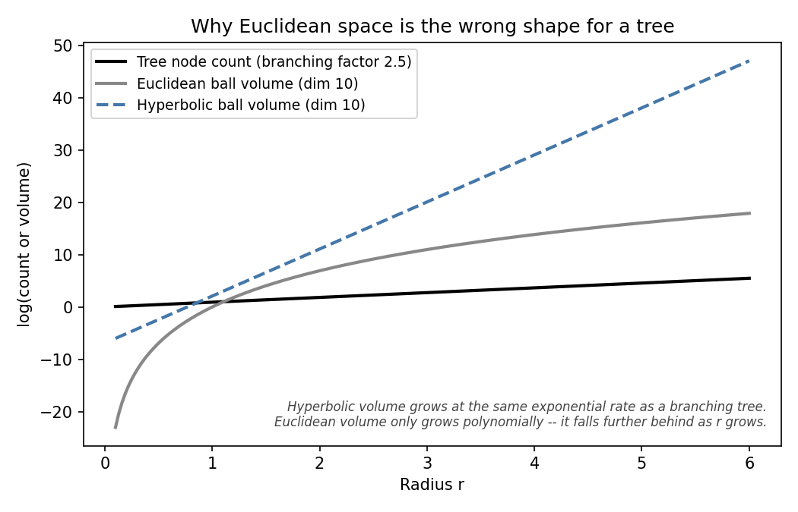
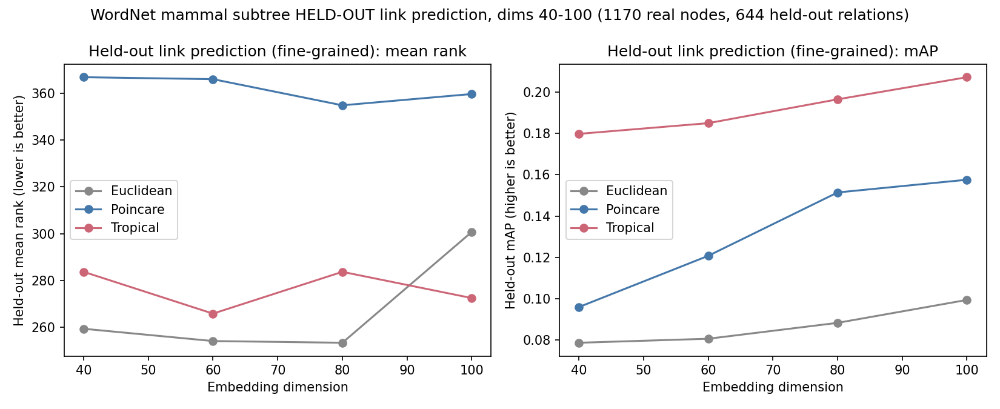
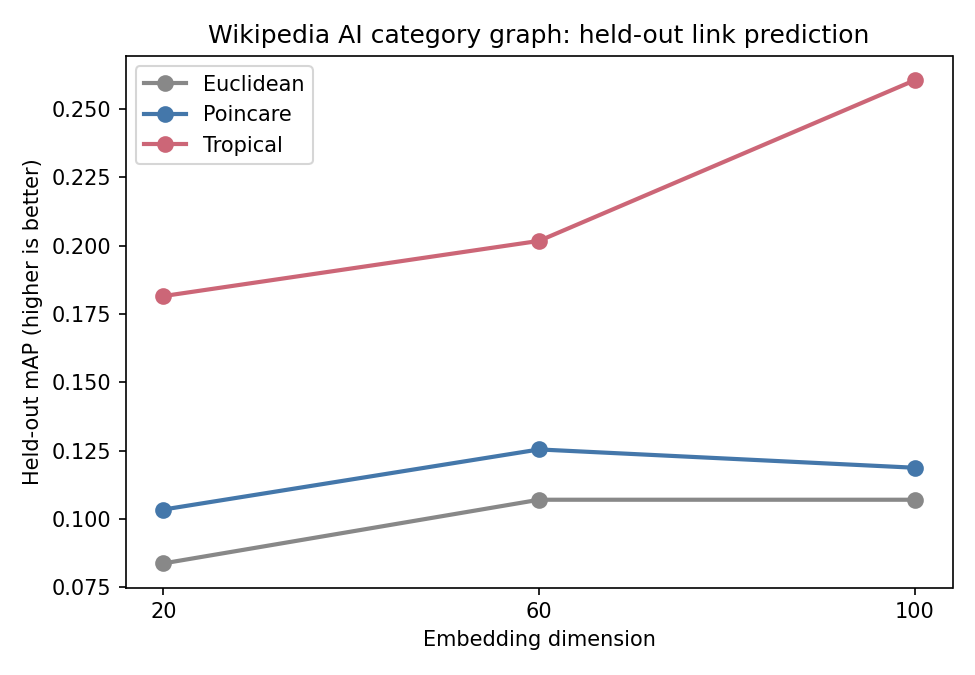

# Tropical, Poincaré & Euclidean graph embeddings

Three geometries for embedding hierarchical/graph-structured data, compared
on real, held-out link prediction — not reconstruction of the training
graph, and not a single toy dataset.

## Why three geometries

| Geometry | Distance | Known for |
|---|---|---|
| Euclidean | `\|\|u - v\|\|` | The default; no structural bias toward hierarchy |
| Poincaré (hyperbolic) | `arcosh(1 + 2\|\|u-v\|\|² / ((1-\|\|u\|\|²)(1-\|\|v\|\|²)))` | Exponential volume growth near the ball boundary matches tree-like branching — the standard choice for hierarchy embedding (Nickel & Kiela, 2017) |
| Tropical (max-plus) | `max_i(u_i - v_i) - min_i(u_i - v_i)` | A piecewise-linear metric tied to tree-metric theory (the four-point condition, the tropical Grassmannian) — see the [root README](../README.md#1-what-is-tropical-geometry) for the full argument |

Tropical's distance depends on only 2 of the `d` embedding dimensions per
comparison (the argmax and argmin coordinates), which gives it a sparser,
different gradient structure than the other two during training (see
training notes below).



## Methodology (applied identically across all 4 datasets)

1. **Real `is_a` / parent-child edges** from an existing ontology or
   category graph — never synthetic/generated hierarchies.
2. **Transitive closure** over those edges to get the full set of
   ancestor-descendant "related" pairs.
3. **90/10 held-out split** of the *relation pairs themselves* (not nodes) —
   train on 90%, then measure whether the trained embedding can recover the
   held-out 10% purely from geometry. This is what actually tests
   generalization, as opposed to reconstruction (train and evaluate on the
   same known pairs), which mostly measures memorization capacity.
4. **Ranking metric**: for each node with held-out relations, rank every
   other node by embedding distance and compute mean average precision
   (mAP) over where the true related nodes land in that ranking.
5. **Training**: cross-entropy over (positive, k negatives) per batch.
   Poincaré uses genuine Riemannian SGD (gradient rescaled by
   `(1-||x||²)²/4`, with a burn-in phase) rather than naive Euclidean-
   gradient optimization, which trains poorly near the ball boundary.
   Tropical trains against an annealed *soft* tropical distance (Maslov
   dequantization: `t·logsumexp(x/t) → max(x)` as `t→0`) since the true
   metric's sparse gradient (only 2 of `d` dims active) causes training
   plateaus; evaluation always uses the true hard metric.
6. **Early stopping** on held-out mAP, not training loss.
7. **Control**: training on completely shuffled/fake edges (same optimizer,
   same schedule) keeps held-out mAP pinned at the random-chance floor for
   the entire run even as training loss drops normally — confirming that a
   real result reflects genuine structure learning, not an artifact of the
   training procedure.

## Datasets

| Dataset | Nodes | Domain | Script |
|---|---|---|---|
| WordNet `mammal.n.01` | 1,170 | Lexical semantics (biology taxonomy) | [tropical_hierarchy_embeddings.py](tropical_hierarchy_embeddings.py) (reconstruction), [tropical_hierarchy_link_prediction.py](tropical_hierarchy_link_prediction.py) (held-out), [tropical_hierarchy_link_prediction_finegrained.py](tropical_hierarchy_link_prediction_finegrained.py) (dims up to 256) |
| WordNet `vehicle.n.01` | 520 | Lexical semantics (man-made objects — a different domain from biology) | [tropical_hierarchy_generalization_check.py](tropical_hierarchy_generalization_check.py) |
| Gene Ontology `immune system process` (GO:0002376) | 553 | Molecular biology — real labels used to train protein-function-prediction models (DeepGO-style, antibody/vaccine design) | [tropical_geneontology_check.py](tropical_geneontology_check.py) (needs `go-basic.obo`, included) |
| Wikipedia "Artificial Intelligence" category graph | 416 | Real-world knowledge graph, crawled live via the MediaWiki API — not a pre-packaged research benchmark | [wiki_kg_train_eval.py](wiki_kg_train_eval.py) (dimension sweep + held-out eval), [wiki_train_and_save.py](wiki_train_and_save.py) (final full-graph embeddings used downstream by the RAG system) |

## Results

### Reconstruction (WordNet mammals — train and evaluate on the same known pairs)

| dim | Euclidean mAP | Poincaré mAP | Tropical mAP |
|---|---|---|---|
| 5 | 0.303 | 0.637 | 0.265 |
| 20 | 0.861 | 0.671 | 0.999 |
| 40 | **1.000** | 0.672 | **1.000** |

Reconstruction alone doesn't separate Euclidean from tropical — both reach
essentially perfect mAP by dim=40. Poincaré plateaus well below both at
~0.67, on this particular controlled-vocabulary subtree. **This is exactly
why reconstruction is the wrong task to judge these geometries on** — it
mostly measures capacity to memorize a fixed, already-seen set of pairs.
Held-out link prediction, below, is what actually discriminates them.

### Held-out link prediction, all 4 datasets, every tested dimension

**WordNet mammals (1,170 nodes):**

| dim | Euclidean mAP | Poincaré mAP | Tropical mAP |
|---|---|---|---|
| 5 | 0.058 | **0.107** | 0.062 |
| 20 | 0.068 | 0.119 | **0.124** |
| 40 | 0.074 | 0.093 | **0.172** |

A separate fine-grained run
([tropical_hierarchy_link_prediction_finegrained.py](tropical_hierarchy_link_prediction_finegrained.py),
checkpointing every 10 epochs instead of 40) extends this sweep to dims
40–100 on the same mammals graph:



Tropical's lead holds all the way to dim=100 here, without Poincaré
catching up the way it does on vehicles and Gene Ontology below — on this
particular dataset, the moderate-dimension advantage is not a narrow
one-point crossover, it persists across the whole 40–100 range tested.

**WordNet vehicles (520 nodes):**

| dim | Euclidean mAP | Poincaré mAP | Tropical mAP |
|---|---|---|---|
| 20 | 0.082 | 0.080 | **0.150** |
| 60 | 0.095 | **0.210** | 0.201 |
| 100 | 0.095 | **0.252** | 0.218 |

**Gene Ontology, immune system process (553 nodes):**

| dim | Euclidean mAP | Poincaré mAP | Tropical mAP |
|---|---|---|---|
| 20 | 0.116 | **0.141** | 0.141 |
| 60 | 0.122 | **0.150** | 0.149 |
| 100 | 0.125 | **0.173** | 0.164 |

**Wikipedia AI category graph (416 nodes):**

| dim | Euclidean mAP | Poincaré mAP | Tropical mAP |
|---|---|---|---|
| 20 | 0.084 | 0.104 | **0.182** |
| 60 | 0.107 | 0.126 | **0.202** |
| 100 | 0.107 | 0.119 | **0.261** |



### Honest reading of these 4 tables

The hoped-for pattern — Poincaré wins at very low dimension, tropical takes
over at moderate dimension — is **clearly confirmed on 2 of the 4
datasets** within the dimension range actually tested: WordNet mammals
(crossover between dim 5 and dim 20) and the Wikipedia AI graph (tropical
ahead at every tested dimension, with its margin *widening* from dim 20 to
dim 100). It does **not** hold as cleanly on the other 2:

- **WordNet vehicles**: tropical wins clearly at dim=20, but Poincaré
  overtakes by dim=60 and extends its lead at dim=100 — the opposite
  direction from the hoped-for pattern at higher dimension on this
  particular graph.
- **Gene Ontology**: Poincaré leads at every tested dimension (tropical and
  Poincaré are essentially tied at dim=20, then Poincaré pulls ahead).
  Tropical's moderate-dimension advantage did not appear within dims
  20–100 here — it may emerge at a dimension beyond what was tested, or
  this graph's structure (553 real biological terms, different branching
  statistics from WordNet) may simply favor hyperbolic geometry more than
  the others do.

Reported plainly rather than smoothed over: **tropical is a genuinely
strong alternative to Poincaré, not a strict replacement for it.** Which
geometry wins depends on the dataset and the dimension, which is itself
useful information — a practitioner embedding a new hierarchy should run
this same held-out sweep on their own graph rather than assume either
geometry wins by default. The dataset where tropical's advantage is
clearest and widens with dimension — the Wikipedia AI graph — is also the
one this project builds the downstream RAG system on (Section 7 of the
[root README](../README.md)), and that dimension choice (100) was made
from this table alone, before looking at any RAG output.

Plots: [`plots/`](plots/) (reconstruction curve, link-prediction vs.
dimension for WordNet mammals, and a fine-grained check up to dim=256).

## Honest limitations

- Tropical does not win on every dataset or every dimension — see above.
- The crossover dimension (where it exists) is not a fixed constant across
  graphs; it must be re-measured per graph, which is exactly what the
  dimension sweep scripts here do.
- Poincaré's long-horizon convergence at very high dimension (e.g. dim=100
  on WordNet mammals) was still slowly improving at 1500 epochs in a
  separate longer run — a longer training budget could narrow some of the
  gaps reported above further.

## Running

```bash
pip install -r ../requirements.txt
cd embeddings
python tropical_hierarchy_embeddings.py              # WordNet mammals, reconstruction
python tropical_hierarchy_link_prediction.py          # WordNet mammals, held-out
python tropical_hierarchy_generalization_check.py     # WordNet vehicles, held-out
python tropical_geneontology_check.py                 # Gene Ontology, held-out
python wiki_kg_train_eval.py                          # Wikipedia graph, dimension sweep + held-out
python wiki_train_and_save.py                         # Wikipedia graph, final embeddings for the RAG demo
```

`wiki_kg_train_eval.py` and `wiki_train_and_save.py` read/write
`../data/wiki_category_graph.json` and `../data/wiki_emb_*.pt` — run the
crawl steps in [`../rag/`](../rag/) first if those files don't exist yet.
